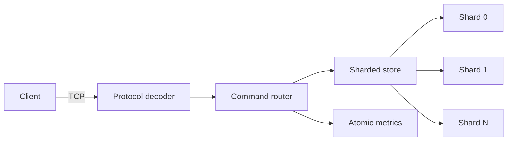
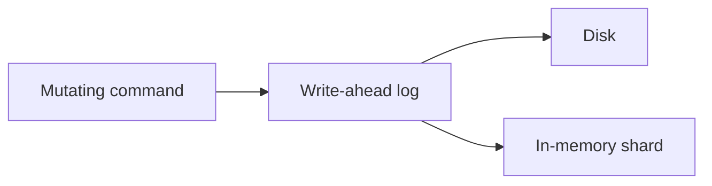
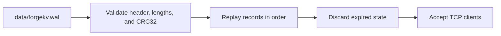

# ForgeKV

High-performance persistent key-value store written in Rust.

> Current status: **Experimental (v0.2.0).** ForgeKV is a systems engineering project and is not production ready.

## Overview

ForgeKV is a persistent, concurrent key-value database built directly on Tokio, TCP, and a versioned binary protocol. It keeps the active data set in a sharded in-memory store and records every mutation in a checksummed write-ahead log (WAL) before changing memory.

The project explores database internals, binary protocol design, bounded input processing, crash recovery, concurrent data structures, graceful shutdown, observability, and reproducible CI validation without placing a web framework or an external database at its core.

## Why ForgeKV?

ForgeKV exists as a focused systems programming portfolio project. It makes the important mechanics visible: network framing, lock scope, mutation ordering, expiration, durability choices, corruption handling, and replay. It is not a Redis-compatible server, a CRUD HTTP API, or a wrapper around another database.

## Features

- Custom versioned binary protocol over TCP
- Binary-safe keys and values with explicit configurable limits
- `PING`, `SET`, `GET`, `DEL`, `EXISTS`, `SETEX`, `TTL`, `PERSIST`, `INFO`, and `STATS`
- Deterministically sharded in-memory store using per-shard read/write locks
- Lazy and periodic background expiration without one task per key
- Binary write-ahead log with CRC32 checksums
- Versioned checksummed snapshots and automatic WAL compaction
- Ordered replay, expired-record handling, and safe final-tail truncation
- Explicit `always`, `everysec`, and `none` fsync policies
- Concurrent Tokio connection handling and graceful shutdown
- Configurable connection limit with rejection metrics
- Ordered client pipelining over one TCP connection
- Prometheus text metrics endpoint without a web framework
- Atomic internal counters exposed by `STATS`
- Integration tests, Criterion benchmarks, container assets, and GitHub Actions
- Zero `unsafe` in v0.2, enforced at crate level

## Architecture



Mutating commands are serialized through the WAL so the order on disk matches the order applied to memory:



At startup, ForgeKV rebuilds its in-memory state before accepting clients:



See [Architecture](docs/architecture.md) for lifecycle and concurrency details.

## How It Works

Each request is a length-prefixed frame containing a protocol version, an opcode, and an opcode-specific payload. The decoder rejects oversized frames before allocating their body. Keys are mapped to shards with deterministic FNV-1a hashing. Reads and unrelated writes can proceed across separate shard locks.

`SET`, `DEL`, `SETEX`, and `PERSIST` first append a checksummed record to the WAL. The mutation remains under the same ordering guard until it is applied to the selected shard. Automatic compaction writes a checksummed snapshot atomically and then resets the WAL. On restart, ForgeKV loads the snapshot before replaying valid WAL records. An incomplete WAL record at the physical end is truncated; checksum failure or structural corruption stops startup.

## Getting Started

Prerequisites for a manual development environment:

- Rust stable (MSRV declared as 1.82)
- Git
- PowerShell only if using the supplied helper scripts

Clone and build:

```bash
git clone https://github.com/thiagomontozo/forgekv.git
cd forgekv
cargo build --release --locked
```

The repository's authoritative executable validation runs in GitHub Actions.

## Running the Server

```bash
cargo run --release --bin forgekv-server
```

The default database address is `127.0.0.1:6380`, metrics are exposed on `127.0.0.1:9090/metrics`, and persistent files use the `data` directory. Set `RUST_LOG=debug` for additional lifecycle diagnostics. User values are never written to logs.

## CLI Usage

The CLI connects through the real TCP protocol; it never calls the store directly.

```bash
forgekv-cli ping
forgekv-cli set user:1 Thiago
forgekv-cli get user:1
forgekv-cli del user:1
forgekv-cli exists user:1
forgekv-cli setex session:abc 60 value
forgekv-cli ttl session:abc
forgekv-cli persist session:abc
forgekv-cli info
forgekv-cli stats
```

CLI keys and values come from command-line UTF-8 arguments. The protocol and database themselves preserve arbitrary bytes. `SETEX` accepts seconds in the CLI; `TTL` reports milliseconds (`-1` means persistent and `-2` means missing). Library clients can use `Client::execute_pipeline` to send up to 1,024 commands before reading their ordered responses.

## Wire Protocol

ForgeKV uses a custom binary protocol, not JSON, RESP, or HTTP. Integers are big-endian and every variable-length field carries an explicit length. The default maximum frame body is 1 MiB.

The complete request, response, status, and error contract is in [Wire Protocol](docs/protocol.md).

## Persistence

The WAL is versioned and stores typed mutation records with timestamps, optional absolute expiration, lengths, and a CRC32 checksum. Snapshots are written to `forgekv.snapshot` through a synchronized temporary file and atomic replacement. `always` synchronizes every mutation, `everysec` synchronizes dirty WAL data once per second, and `none` leaves physical persistence to the operating system.

See [Persistence](docs/persistence.md) for the byte layout and crash semantics.

## TTL

`SETEX` stores an absolute expiration timestamp. `GET`, `EXISTS`, and `TTL` lazily remove expired entries. A single cancellation-aware background task periodically scans all shards and removes expired entries. ForgeKV never creates one Tokio task per key.

## Configuration

| Variable | Default | Meaning |
|---|---:|---|
| `FORGEKV_HOST` | `127.0.0.1` | TCP bind host |
| `FORGEKV_PORT` | `6380` | TCP bind port |
| `FORGEKV_DATA_DIR` | `data` | Directory containing `forgekv.wal` |
| `FORGEKV_SHARDS` | `64` | Number of in-memory shards (`1..=4096`) |
| `FORGEKV_MAX_FRAME_SIZE` | `1048576` | Maximum frame body bytes |
| `FORGEKV_MAX_KEY_SIZE` | `4096` | Maximum key bytes |
| `FORGEKV_MAX_VALUE_SIZE` | `1048576` | Maximum value bytes |
| `FORGEKV_EXPIRATION_INTERVAL_MS` | `1000` | Background expiration interval |
| `FORGEKV_FSYNC` | `always` | `always`, `everysec`, or `none` |
| `FORGEKV_MAX_CONNECTIONS` | `1024` | Concurrent clients; range `1..=1000000` |
| `FORGEKV_WAL_COMPACTION_THRESHOLD_BYTES` | `67108864` | WAL size that triggers compaction; `0` disables it |
| `FORGEKV_METRICS_ENABLED` | `true` | Enable the Prometheus text endpoint |
| `FORGEKV_METRICS_HOST` | `127.0.0.1` | Metrics bind host |
| `FORGEKV_METRICS_PORT` | `9090` | Metrics bind port |
| `RUST_LOG` | `info` | `tracing-subscriber` filter |

Invalid settings fail startup with a descriptive error. Network frame limits remain authoritative, so a configured value maximum cannot make a request exceed the frame maximum.

## Testing

The repository contains deterministic unit and integration coverage for configuration, protocol framing, command parsing, sharding, concurrency, TTL, WAL encoding, checksums, replay, restarts, truncated tails, corruption, TCP commands, multiple clients, and malformed input.

```bash
cargo test --all
cargo clippy --all-targets --all-features -- -D warnings
cargo fmt --all -- --check
```

These commands are run remotely by `.github/workflows/ci.yml` on pushes to `main` and pull requests.

## Benchmarking

Criterion benchmarks cover in-memory `SET`, `GET` hit, `GET` miss, and snapshot extraction over 1,000 entries:

```bash
cargo bench --bench store
```

On Windows, `scripts/benchmark.ps1` runs the same suite. The manual `Benchmarks` GitHub Actions workflow can run it remotely. No benchmark numbers are claimed here: results depend on hardware, operating system, toolchain, and workload.

## Docker

The multi-stage image builds both binaries and runs the server as an unprivileged user with `/data` as its persistent directory.

```bash
docker build -t forgekv:0.2.0 .
docker compose up -d
```

Ports `6380` and `9090` are published and the Compose volume `forgekv-data` retains the WAL and snapshot.

## Metrics

When enabled, `GET /metrics` exposes internal counters in Prometheus text format:

```bash
curl http://127.0.0.1:9090/metrics
```

The endpoint is deliberately separate from the binary database protocol and does not expose stored keys or values.

## Project Structure

```text
src/
  bin/          server and network CLI entry points
  client/       TCP protocol client
  command/      command model and payload parser
  persistence/  WAL, snapshots, compaction, and recovery
  protocol/     binary frames and async codec
  server/       accept loop, connection lifecycle, routing, metrics export
  store/        entries, shards, TTL, deterministic hashing
  config.rs     validated environment configuration
  metrics.rs    lock-free counters
tests/          protocol, store, persistence, server integration
benches/        Criterion store benchmarks
docs/           technical documentation and ADRs
scripts/        manual PowerShell smoke and benchmark helpers
```

## Design Decisions

- [ADR 0001: Use Rust](docs/decisions/0001-use-rust.md)
- [ADR 0002: Custom binary protocol](docs/decisions/0002-custom-binary-protocol.md)
- [ADR 0003: Sharded store](docs/decisions/0003-sharded-store.md)
- [ADR 0004: Write-ahead log](docs/decisions/0004-write-ahead-log.md)
- [ADR 0005: Snapshots and compaction](docs/decisions/0005-snapshots-and-compaction.md)

## Limitations

- Single-node only; no replication or consensus
- Mutations share one WAL ordering guard
- No authentication, authorization, or TLS termination
- No transaction groups or compare-and-swap operations
- Background expiration scans shards rather than using an expiration index
- `FORGEKV_FSYNC=none` can lose recent acknowledged writes after a crash
- Snapshots briefly serialize mutations while their immutable entry list is captured
- Pipelining preserves order but does not include request identifiers or out-of-order responses

## Roadmap

### v0.3

- Leader/follower replication
- Incremental replication

### v0.4

- Cluster experiments
- Partitioning
- Consistent hashing

## Contributing

Issues and focused pull requests are welcome. Please keep the project constraints intact: stable Rust, no unsafe code, a custom TCP protocol, small justified dependencies, and explicit failure behavior. Run formatting, lint, and tests before submitting when your environment allows it.

## License

ForgeKV is available under the [MIT License](LICENSE). Copyright 2026 Thiago Montozo.
